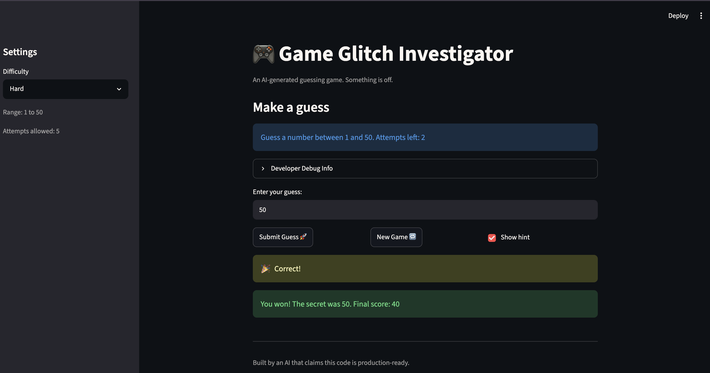

# 🎮 Game Glitch Investigator: The Impossible Guesser

## 🚨 The Situation

You asked an AI to build a simple "Number Guessing Game" using Streamlit.
It wrote the code, ran away, and now the game is unplayable. 

- You can't win.
- The hints lie to you.
- The secret number seems to have commitment issues.

## 🛠️ Setup

1. Install dependencies: `pip install -r requirements.txt`
2. Run the broken app: `python -m streamlit run app.py`

## 🕵️‍♂️ Your Mission

1. **Play the game.** Open the "Developer Debug Info" tab in the app to see the secret number. Try to win.
2. **Find the State Bug.** Why does the secret number change every time you click "Submit"? Ask ChatGPT: *"How do I keep a variable from resetting in Streamlit when I click a button?"*
3. **Fix the Logic.** The hints ("Higher/Lower") are wrong. Fix them.
4. **Refactor & Test.** - Move the logic into `logic_utils.py`.
   - Run `pytest` in your terminal.
   - Keep fixing until all tests pass!

## 📝 Document Your Experience

- Purpose: This is a number guessing game built with Streamlit where players try to guess a secret number within a limited number of attempts. Three difficulty levels (Easy: 1-20, Normal: 1-100, Hard: 1-50) adjust the range and attempt limit. Players earn points based on how accurate their guesses are given the number of previous attempts.
- Bugs found: Backwards feedback hints ("Go LOWER!" when you guessed too low), Difficulty setting doesn't reflect in the actual game (UI shows wrong range, secret stays 1-100), "No bounds checking on guesses" (can guess outside the range)
- Fixes: fixed the backwards logic affecting hints, made sure variables were used to reflect the difficulty ranges rather than using hard-coded ranges.

## 📸 Demo Walkthrough

Describe your fixed game in numbered steps so a reader can follow along without watching a video:

1. <!-- Describe this step --> clone the repo to computer
2. <!-- Describe this step --> cd into project directory
3. <!-- Describe this step -->Launch the game using python -m streamlit run app.py
4. <!-- Describe this step --> start guessing (toggle difficulty if preferred, but try not to peek at the answer😉)
5. use the butttons below the textbox to either show a hint, submit a Guess or load up a new game


**Screenshot** *(optional)*: 

## 🧪 Test Results

```
# Paste your pytest output here, e.g.:
pytest
===================== test session starts =====================
platform darwin -- Python 3.13.13, pytest-9.0.3, pluggy-1.6.0
rootdir: /Users/zurielolu-silas/Desktop/My Learning/Codepath/A110/Project1/ai110-module1show-gameglitchinvestigator-starter
plugins: anyio-4.13.0
collected 22 items                                            

tests/test_game_logic.py ......................         [100%]

===================== 22 passed in 0.02s ======================

```

## 🚀 Stretch Features

- [ ] [If you choose to complete Challenge 4, describe the Enhanced UI changes here — a screenshot is optional]
